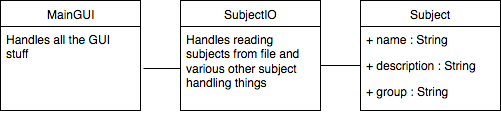

# aihelotto-ohha
Javalabra, 2017 kesä. Aiheenarvontakikkare.

## Hieman tarkempi kuvaus

Tämä javasofta lukee tiedostosta aiheet, niiden ryhmät ja kuvaukset, ja arpoo niistä haluamasi optioiden mukaan yhden aiheen toteutettavaksi.

[Aiheen kuvaus](dokumentaatio/aiheenKuvausJaRakenne.md)

[Tuntikirjanpito](dokumentaatio/tuntikirjanpito.md)

[pit-raportti](https://htmlpreview.github.io/?https://github.com/mattikan/aihelotto-ohha/blob/master/dokumentaatio/pit/viikko 3/index.html)

[checkstyle-raportti](https://htmlpreview.github.io/?https://github.com/mattikan/aihelotto-ohha/blob/master/dokumentaatio/checkstyle/viikko 3/checkstyle.html)